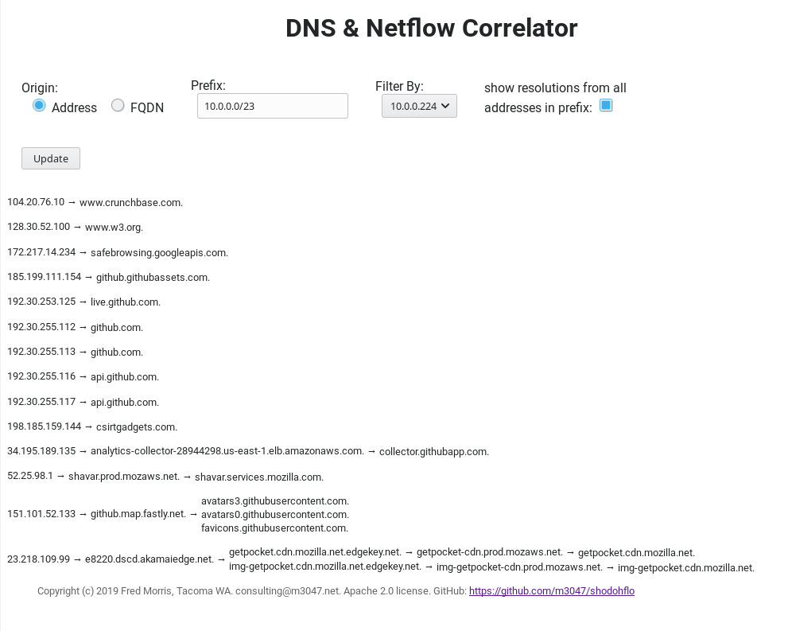

# "Show DoH Flow": DNS and netflow correlator

This tool was inspired by a need to see whether netflows correlated with DNS lookups, which in turn is motivated by
the push for _DNS over HTTP_. DoH apparently appeals to people who want to trade visibility into DNS traffic by their
coffee shop for visibility into that traffic by advertising and cloud infrastructure providers. On the other hand
that local DNS traffic is utilized in offices and other controlled access environments as an access control / auditing
mechanism.

### Installation

1. Follow the general instructions in the `install/` directory.
1. Make sure you have `Flask` and `redis` installed. Both are available with `pip3`.
1. Copy `configuration_sample.py` to `configuration.py` and make any changes.
1. Make sure the agents are running and capturing data to _Redis_. You might run `examples/count_client_keys.py` to verify this.
1. You should be able to run `app.py` and point a browser at it. By default it will be at `http://localhost:3047/`.

This is a _WSGI_ app. For security and other reasons you probably don't want to put the _Werkzeug_ app directly up
on the internet. The _Flask_ documentation discusses numerous deployment options: http://flask.pocoo.org/docs/1.0/deploying/

### Skins / Themes

The skin which is used is determined by the `template` parameter provided with the GET request, or if not supplied by the
`DEFAULT_TEMPLATE` configuration setting. The available templates are determined by the `AVAILABLE_TEMPLATES` configuration
setting.

A _skin_ consists of two items. Assuming that the name of the skin is `my_skin`:

* **a renderer* in `renderers/`, with the name `my_skin.py`
* **a template* in `templates/`, with the name `my_skin.html`

In most cases the template will in turn reference CSS styles in `static/`.

##### Shipped skins

Two skins are shipped:

* **graph** is the vanilla, very first version
* **graph2** which is now the default, has rollovers which provide additional metadata:
  * **clients** the "our network" addresses which generated the artifacts
  * **types** the type of artifact; usually there is only one
  * **ports** netflows, only used when the origin is _address_, provide a list of the remote ports
